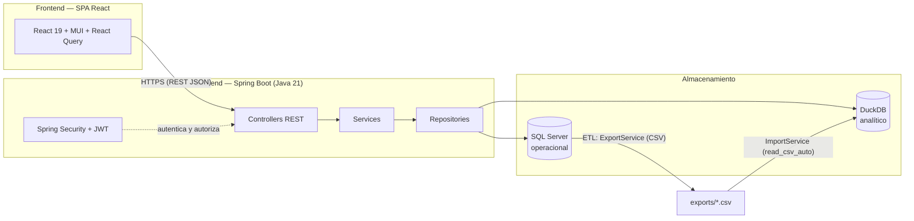

# Gov Connect

**Sistema Inteligente de Automatización y Analítica para Entidades Públicas**

## Descripción

Gov Connect es una plataforma web para entidades públicas colombianas que centraliza indicadores financieros, presupuestales y contractuales en un **dashboard ejecutivo**, **analítica de datos** y **automatización de procesos**.

Resuelve el problema de tener la información dispersa (SECOP, hojas de cálculo, sistemas financieros): unifica contratos, presupuestos y recaudos en un solo lugar, los transforma en indicadores accionables (p. ej. *qué contratos vencen en los próximos 30 días*) y automatiza la notificación de eventos críticos por correo.

Está pensado para directores/as de contratación, secretarías de hacienda/planeación y equipos de control de entidades públicas.

## Características principales

- **Dashboard ejecutivo** (rol `ADMIN`): resumen ejecutivo, recaudos mensuales, contratos por vencer y ejecución presupuestal por dependencia.
- **Analítica de datos** (DuckDB): tendencia mensual, resumen financiero, ranking de dependencias, recaudos por concepto y medio de pago, contratos por estado, valor contratado por dependencia y top de contratistas.
- **Gestión de contratos**: catálogo con filtros por estado y búsqueda libre, más resumen agregado.
- **ETL asíncrono**: sincroniza SQL Server → DuckDB (con `taskId` para seguir el avance).
- **Ingesta de datos desde CSV**: importación asíncrona de contratos (SECOP II), presupuestos y recaudos.
- **Automatización**: alerta de contratos por vencer enviada por correo (SMTP), con ejecución programada o manual, y registro de ejecuciones en `automation_logs`.
- **Autenticación JWT** con cookies `HttpOnly`, refresh token rotativo y rate limiting en el login.
- **Control de acceso por roles** (`ADMIN` / `USER`).

## Arquitectura

Arquitectura modular orientada al dominio (ADR-006), separada en dos capas: una SPA React (frontend) y una API REST Spring Boot (backend). Los datos se dividen en dos motores (ADR-007):



- **SQL Server** es el almacén transaccional/operacional (CRUD, datos diarios). El dashboard consulta **vistas** (`vw_*`), nunca tablas directamente (ADR-003).
- **DuckDB** es el motor analítico embebido (KPIs, tendencias, comparativos). Se alimenta por ETL.
- Cada módulo (`dashboard`, `analytics`, `contracts`, `ingestion`, `automation`, `auth`, `shared`) es autocontenido con `controller`, `service`, `repository` y `dto`.

## Stack tecnológico

| Categoría | Tecnologías |
|---|---|
| **Backend** | Java 21, Spring Boot 4.1, Maven (wrapper) |
| **Frontend** | React 19, TypeScript 6, Vite 8, Material UI 9, React Query 5, Recharts 3, React Router 7 |
| **Bases de datos** | SQL Server (operacional), DuckDB 1.3 (analítico) |
| **Analítica / ETL** | DuckDB JDBC, Apache Commons CSV, export/import CSV |
| **Seguridad** | Spring Security, JWT (jjwt 0.12.5), BCrypt, Bucket4j (rate limiting) |
| **Automatización** | Spring Mail (SMTP), scheduling por cron |
| **Documentación / API** | springdoc-openapi (Swagger UI), Spring Boot Actuator |

## Estructura del proyecto

```
gov-connect/
├── backend/            # API REST — Spring Boot (Java 21, Maven)
│   └── src/main/java/com/govconnect/
│       ├── auth/       # autenticación JWT y roles
│       ├── dashboard/  # KPIs operacionales (vistas SQL Server)
│       ├── analytics/  # analítica DuckDB + ETL
│       ├── contracts/  # catálogo de contratos
│       ├── ingestion/  # ingesta asíncrona de CSV
│       ├── automation/ # alertas por correo + logs
│       └── shared/     # config, constantes, excepciones, ApiResponse
├── frontend/           # SPA — React 19 + TypeScript (Vite)
│   └── src/            # api/, components/, context/, hooks/, pages/, routes/, types/, utils/
├── database/
│   ├── sqlserver/      # DDL: tablas, constraints, índices, vistas y migraciones
│   ├── seed/           # datos semilla de demostración
│   └── analytics/      # archivo DuckDB (analytics.duckdb — NO versionado)
├── docs/               # documentación de arquitectura y decisiones
└── exports/            # CSV generados por el ETL (NO versionados)
```

## Módulos principales

| Módulo | Responsabilidad |
|---|---|
| `auth` | Login, refresh y logout con JWT en cookies `HttpOnly`; roles `ADMIN`/`USER`. |
| `dashboard` | KPIs operacionales servidos desde vistas de SQL Server (exclusivo `ADMIN`). |
| `analytics` | Consultas analíticas sobre DuckDB + orquestación del ETL asíncrono. |
| `contracts` | Listado del catálogo de contratos con filtros y resumen agregado. |
| `ingestion` | Importación asíncrona de CSV (contratos SECOP, presupuestos, recaudos). |
| `automation` | Alerta de contratos por vencer por correo (SMTP) + registro de ejecuciones. |
| `shared` | Configuración, `ApiResponse<T>`, mensajes, excepciones y utilidades transversales. |

## Requisitos previos

| Componente | Requisito | Versión |
|---|---|---|
| **Backend** | Java JDK | 21+ |
| **Backend** | Maven | wrapper incluido (`./backend/mvnw`) |
| **Base de datos** | SQL Server | 2017+ (desarrollo probado sobre SQL Server 2025) |
| **Frontend** | Node.js | ≥ 20.19 (requerido por Vite 8) |
| **Analítica** | DuckDB | embebido, sin instalación (se resuelve por Maven) |

> No es necesario instalar Maven ni DuckDB manualmente: el wrapper de Maven y el driver JDBC de DuckDB se resuelven solos.

## Instalación y ejecución

### 1. Clonar el repositorio

```bash
git clone https://github.com/AylinMorales01/gov-connect.git
cd gov-connect
```

### 2. Configurar variables de entorno

```bash
cp .env.example .env
```

Edita `.env` y completa las variables con tus valores (ver [Configuración](#configuración)).

> Para Docker son obligatorias, como mínimo, `MSSQL_SA_PASSWORD` (contraseña fuerte del `sa` de SQL Server) y `JWT_SECRET` (clave de ≥32 caracteres).

---

### Opción A — Docker (recomendado)

Levanta toda la infraestructura (SQL Server + inicialización de la BD + backend + frontend) con un solo comando. Requiere **Docker** (con el plugin *Compose* v2) instalado.

**Desarrollo con hot reload** (Vite HMR en el frontend + Spring DevTools en el backend):

```bash
docker compose up --build
```

Compose carga `docker-compose.override.yml` automáticamente, por lo que este es el modo de desarrollo:

- Frontend (Vite, HMR): `http://localhost:5173`
- Backend / API: `http://localhost:8080/api/v1`
- Swagger UI: `http://localhost:8080/swagger-ui`
- Actuator: `http://localhost:8080/actuator/health`

**Modo "prod-like"** (frontend compilado y servido por nginx, backend con el JAR):

```bash
docker compose -f docker-compose.yml up --build
```

- Frontend: `http://localhost` (puerto `FRONTEND_PORT`, default `80`)

> En el primer arranque, el contenedor `db-init` crea la base `GOV_CONNECT_DB`, aplica el esquema (`01`–`08`), crea los usuarios de prueba y carga los datos demo (`SEED_DEMO=true` en `.env`). No necesitas ejecutar los scripts SQL a mano.

**Usuarios de prueba** (solo desarrollo):

| Usuario | Contraseña | Rol |
|---|---|---|
| `admin` | `password` | ADMIN (acceso completo) |
| `usuario` | `password` | USER (sin acceso a `/dashboard`) |

**Comandos útiles:**

```bash
docker compose ps                    # estado de los servicios
docker compose logs -f backend       # logs del backend
docker compose logs db-init          # ver si la inicialización de la BD terminó
docker compose down                  # detener (conserva los datos)
docker compose down -v               # detener y BORRAR volúmenes (BD y DuckDB)
```

**Notas:**

- El primer `up --build` tarda: descarga la imagen de SQL Server y compila las imágenes. El arranque de SQL Server puede tardar 30–60 s; por eso el backend espera con `depends_on: service_healthy`.
- La imagen de SQL Server 2022 es **amd64**. En Apple Silicon (M1/M2/M3) corre bajo emulación (Rosetta) y puede ser lenta o requerir una alternativa.
- `docker/db-init/init.sh` es idempotente: si `GOV_CONNECT_DB` ya existe, no recrea la base.
- En el modo prod-like (`-f docker-compose.yml`), la base SQL Server persiste en el volumen `sqlserver-data`, pero DuckDB (`DUCKDB_PATH`) y los CSV del ETL (`ETL_EXPORT_DIR`) viven en el filesystem efímero del contenedor. Para producción, monta esos dos paths en un volumen/plano persistente.
- La contraseña `MSSQL_SA_PASSWORD` queda fijada en el volumen la primera vez que SQL Server arranca. Si la cambias en `.env` después, borra el volumen para que tome efecto: `docker compose down -v`.
- Los usuarios `admin`/`usuario` y los datos demo son **solo para desarrollo**; elimínalos antes de exponer el entorno.

---

### Opción B — Sin Docker (instalación manual)

#### 3. Crear la base de datos

Ejecuta los scripts SQL en orden desde `database/sqlserver/`:

```
01-create-database.sql
02-create-tables.sql
03-create-constraints.sql
04-create-indexes.sql
05-create-views.sql
06-sprint72-migration.sql        # usuarios de prueba (admin / usuario)
07-refresh-token-migration.sql   # columna token_version (solo si migras una BD existente)
08-secop-columns-migration.sql   # amplía columnas de contracts para SECOP II (antes de importar un export real)
```

> **Nota**: para una base de datos nueva, `02-create-tables.sql` ya crea las columnas anchas de `contracts`; `08` solo es necesario si importas un export real de SECOP II sobre una base antigua. `07` aplica únicamente a bases creadas antes de la migración de refresh tokens.

(Opcional) Carga datos semilla de demostración desde `database/seed/`.

#### 4. Iniciar el backend

> **Importante**: ejecuta desde la **raíz del repositorio** (no desde `backend/`). Las rutas relativas de DuckDB (`database/analytics/…`) y de `exports/` dependen de ello.

```bash
./backend/mvnw -f backend/pom.xml spring-boot:run
```

- API: `http://localhost:8080/api/v1`
- Swagger UI: `http://localhost:8080/swagger-ui`
- Actuator: `http://localhost:8080/actuator/health`

#### 5. Iniciar el frontend

```bash
cd frontend
npm install
npm run dev
```

La aplicación estará disponible en `http://localhost:5173`.

## Configuración

Todas las variables están documentadas en `.env.example`. Nunca se commitean valores reales: `.env`, claves y certificados están excluidos por `.gitignore`.

```env
# Backend — SQL Server
GOVCONNECT_DB_URL=jdbc:sqlserver://localhost:1433;databaseName=GOV_CONNECT_DB;encrypt=true;trustServerCertificate=true
GOVCONNECT_DB_USERNAME=your_username
GOVCONNECT_DB_PASSWORD=your_password

# JWT (obligatorio; la app no inicia sin JWT_SECRET)
JWT_SECRET=your_secret_32_chars_min
JWT_EXPIRATION=3600
JWT_REFRESH_EXPIRATION=604800

# DuckDB / ETL
DUCKDB_PATH=database/analytics/analytics.duckdb
ETL_EXPORT_DIR=exports

# SMTP (alerta de contratos por vencer; host vacío => la alerta no envía correo)
SMTP_HOST=
SMTP_PORT=587
SMTP_USERNAME=your_username
SMTP_PASSWORD=your_password
SMTP_AUTH=true
SMTP_STARTTLS=true

# Alerta programada
# ⚠️ ALERT_EXPIRING_ENABLED solo controla el CRON; el disparo manual por API
#    (POST /automation/expiring-contracts/alert) sigue activo aunque sea false.
ALERT_EXPIRING_ENABLED=true
ALERT_EXPIRING_RECIPIENTS=destinatario1@example.com,destinatario2@example.com
ALERT_EXPIRING_DAYS=30
ALERT_EXPIRING_FROM=no-reply@govconnect.com
ALERT_EXPIRING_CRON=0 0 7 * * MON-FRI

# Perfiles / entorno
SPRING_PROFILES_ACTIVE=dev
SWAGGER_ENABLED=true
SERVER_PORT=8080

# Frontend
VITE_API_URL=http://localhost:8080/api/v1
```

> **Ejemplo SMTP (desarrollo)** — Mailtrap: `SMTP_HOST=sandbox.smtp.mailtrap.io`, `SMTP_PORT=2525`, `SMTP_USERNAME=<usuario>`, `SMTP_PASSWORD=<contraseña>`, `SMTP_AUTH=true`, `SMTP_STARTTLS=true`. Gmail (con *app password*): `SMTP_HOST=smtp.gmail.com`, `SMTP_PORT=587`, `SMTP_AUTH=true`, `SMTP_STARTTLS=true`.

## API

- **Base URL**: `/api/v1`
- **Swagger/OpenAPI**: `http://localhost:8080/swagger-ui` (habilitado en `dev`, deshabilitado en `prod`).
- **Contrato**: todas las respuestas usan `ApiResponse<T>` → `{ success, message, timestamp, data }`.

Grupos de endpoints:

| Grupo | Acceso | Endpoints principales |
|---|---|---|
| Auth | público | `POST /auth/login`, `/auth/refresh`, `/auth/logout` |
| Auth | autenticado | `GET /auth/me` |
| Dashboard | ADMIN | `GET /dashboard/summary`, `/monthly-collections`, `/expiring-contracts`, `/budget-execution` |
| Analytics | autenticado | `GET /analytics/health`, `/monthly-trend`, `/financial-overview`, `/department-ranking`, `/collections-by-concept`, `/collections-by-payment-method`, `/contracts-by-status`, `/contracts-value-by-department`, `/top-contractors` |
| Analytics (ETL) | autenticado | `POST /analytics/etl/run`, `GET /analytics/etl/status/{taskId}` |
| Contracts | autenticado | `GET /contracts`, `/contracts/summary` |
| Ingestion | ADMIN | `POST /ingestion/contracts\|budgets\|collections`, `GET /ingestion/status/{taskId}` |
| Automation | autenticado | `POST /automation/logs`, `GET /automation/logs` |
| Automation | ADMIN | `POST /automation/expiring-contracts/alert` |

El detalle completo de cada endpoint está en `docs/06-API.md` y en Swagger.

## Flujo de datos

1. **Ingesta**: un CSV (SECOP II, presupuestos o recaudos) se sube por `POST /ingestion/*`, se valida/normaliza y se inserta en **SQL Server**.
2. **ETL**: `POST /analytics/etl/run` (o automáticamente al terminar una ingesta) exporta las tablas a `exports/*.csv` y las carga en **DuckDB** con `read_csv_auto`.
3. **Consulta**: los endpoints de `/analytics` leen de DuckDB; el dashboard y los contratos leen de SQL Server.
4. **Presentación**: la SPA consume la API y muestra gráficas y tablas.

```
CSV → SQL Server → ExportService (CSV) → exports/ → ImportService → DuckDB → Analytics API → Frontend
```

## Ingesta de datos

La ingesta importa datos operacionales desde CSV a **SQL Server**. Es **asíncrona**: cada
`POST` devuelve `202 Accepted` con un `taskId` y el avance se sigue por `GET /ingestion/status/{taskId}`.
Al terminar, dispara automáticamente el ETL para refrescar DuckDB (el `etlTaskId` aparece en el `summary`).

Todos los endpoints requieren rol **ADMIN**:

| Método | Ruta | CSV esperado |
|---|---|---|
| POST | `/ingestion/contracts` | `numero_contrato, contratista, objeto, valor, fecha_inicio, fecha_fin, estado, dependencia` |
| POST | `/ingestion/budgets` | `dependencia, anio, asignado, ejecutado[, disponible]` |
| POST | `/ingestion/collections` | `fecha, concepto, contribuyente, monto, medio_pago, dependencia` |
| GET | `/ingestion/status/{taskId}` | Estado y resumen de una importación encolada |

Ejemplo de subida de un CSV de contratos:

```bash
# 1) Login (guarda las cookies HttpOnly en un cookie jar)
curl -c cookies.txt -X POST http://localhost:8080/api/v1/auth/login \
  -H "Content-Type: application/json" \
  -d '{"username":"admin","password":"password"}'

# 2) Sube el CSV (campo multipart `file`)
curl -b cookies.txt -X POST http://localhost:8080/api/v1/ingestion/contracts \
  -F "file=@database/seed/contratos-secop-ejemplo.csv"

# 3) Consulta el avance (reemplaza <taskId>)
curl -b cookies.txt http://localhost:8080/api/v1/ingestion/status/<taskId>
```

La tarea expone `{ taskId, state, message, startedAt, completedAt, summary }`. En `COMPLETED`,
`summary` es `{ totalRows, imported, updated, skipped, errors, etlTaskId }` (`errors` viene
acotado a 500; el total de omitidas lo da `skipped`).

**Contratos SECOP II**: la ingesta acepta las columnas propias del export real (alias como
`referencia_del_contrato`, `proveedor_adjudicado`, `objeto_del_contrato`, …) y normaliza sus
estados. El detalle completo —tabla de alias, estados y reglas de upsert/fallback— está en
[`docs/06-API.md` → Ingestion → SECOP II](docs/06-API.md#secop-ii).

## Automatización

- **Alerta de contratos por vencer (G3)**: detecta contratos `ACTIVE` que vencen en los próximos `days` días y envía un correo HTML a los destinatarios configurados mediante **Spring Mail (SMTP)**.

  **Cómo se dispara:**
  - **Programado (cron):** lunes–viernes a las 7:00 por defecto (`app.alert.expiring-contracts.cron`). Solo corre si `ALERT_EXPIRING_ENABLED=true`; ponerlo en `false` desactiva **únicamente el cron**, no el disparo manual.
  - **Manual (ADMIN):** `POST /api/v1/automation/expiring-contracts/alert`. No hay botón en la UI (la página *Automatización* solo muestra los logs); se dispara desde **Swagger** (`/swagger-ui`) o por `curl`:
    ```bash
    # 1) Login (guarda las cookies HttpOnly en un cookie jar)
    curl -c cookies.txt -X POST http://localhost:8080/api/v1/auth/login \
      -H "Content-Type: application/json" \
      -d '{"username":"admin","password":"password"}'

    # 2) Disparo manual de la alerta
    curl -b cookies.txt -X POST http://localhost:8080/api/v1/automation/expiring-contracts/alert
    ```

  **Resultado** (siempre queda registrado en `automation_logs`, sin detener la app):
  - Sin destinatarios → `SKIPPED`.
  - `spring.mail.host` vacío (SMTP no configurado) → `ERROR`.
  - Sin contratos por vencer → `SUCCESS` con mensaje "No hay contratos por vencer…".
  - Envío correcto → `SUCCESS` con el número de correos enviados.

- **Registro de ejecuciones**: cada ejecución queda registrada en `automation_logs` (estado `SUCCESS`/`ERROR`/`SKIPPED`, proceso, mensaje y tiempo). La SPA lo muestra en la página de *Automatización*.
- **Integración futura**: los endpoints `POST /automation/logs` y `GET /automation/logs` son el punto de integración para registrar ejecuciones de orquestadores externos. Workflows tipo **n8n** podrían llegar a implementarse en el futuro llamando a estos endpoints, pero hoy no hay workflows n8n versionados en el repositorio.

## SMTP — correo de la alerta de contratos por vencer

Para que el cron o el disparo manual envíen correo, el backend necesita un servidor SMTP. Si `SMTP_HOST` queda vacío, Spring no crea el `JavaMailSender` y la alerta registra `ERROR` en `automation_logs` sin enviar nada.

### Configuración mínima

En `.env` (o variables de entorno):

```env
# ── SMTP ──────────────────────────────────────────────
SMTP_HOST=smtp.gmail.com
SMTP_PORT=587
SMTP_USERNAME=tu.correo@gmail.com
SMTP_PASSWORD=tu_app_password
SMTP_AUTH=true
SMTP_STARTTLS=true

# ── Alerta ────────────────────────────────────────────
ALERT_EXPIRING_RECIPIENTS=tu.correo@gmail.com,otro@dominio.com
ALERT_EXPIRING_FROM=tu.correo@gmail.com
ALERT_EXPIRING_DAYS=30
ALERT_EXPIRING_CRON=0 0 7 * * MON-FRI
```

Variables clave:

| Variable | Rol |
|---|---|
| `SMTP_HOST` / `SMTP_PORT` | Servidor SMTP. `SMTP_HOST` vacío = correo deshabilitado. |
| `SMTP_USERNAME` / `SMTP_PASSWORD` | Credenciales de autenticación en el SMTP. |
| `SMTP_AUTH` / `SMTP_STARTTLS` | `true` para login y cifrado STARTTLS (puerto 587). |
| `ALERT_EXPIRING_RECIPIENTS` | **A quién llega el correo** (separado por coma). |
| `ALERT_EXPIRING_FROM` | Remitente; en Gmail debe ser igual a `SMTP_USERNAME`. |
| `ALERT_EXPIRING_DAYS` | Ventana de días para considerar un contrato "por vencer". |
| `ALERT_EXPIRING_CRON` | Horario de la ejecución automática. |

> **Gmail**: usa una *app password* (Cuenta de Google → Seguridad → Verificación en 2 pasos → Contraseñas de aplicaciones), no tu contraseña normal, y deja `ALERT_EXPIRING_FROM` igual a `SMTP_USERNAME`.
>
> **Desarrollo (sin inbox real)**: Mailtrap captura los correos en su panel — `SMTP_HOST=sandbox.smtp.mailtrap.io`, `SMTP_PORT=2525`, `SMTP_USERNAME=<usuario>`, `SMTP_PASSWORD=<contraseña>`, `SMTP_AUTH=true`, `SMTP_STARTTLS=true`.

### Disparo manual (sin esperar al cron)

El disparo manual usa el endpoint ADMIN `POST /api/v1/automation/expiring-contracts/alert` y **no depende del cron** (funciona aunque `ALERT_EXPIRING_ENABLED=false`). No hay botón en la UI; se hace desde **Swagger** (`/swagger-ui`) o por `curl`:

```bash
# 1) Login (guarda las cookies HttpOnly en un cookie jar)
curl -c cookies.txt -X POST http://localhost:8080/api/v1/auth/login \
  -H "Content-Type: application/json" \
  -d '{"username":"admin","password":"password"}'

# 2) Disparo manual de la alerta
curl -b cookies.txt -X POST http://localhost:8080/api/v1/automation/expiring-contracts/alert
```

Para probar el cron sin esperar al lunes 7:00, cambia a `ALERT_EXPIRING_CRON=0 * * * * *` (cada minuto) y reinicia el backend.

### Verificación

Revisa el resultado en `GET /automation/logs` (página *Automatización*):

- `SUCCESS` → correo(s) enviado(s), o "No hay contratos por vencer…".
- `SKIPPED` → no hay `ALERT_EXPIRING_RECIPIENTS`.
- `ERROR` → `SMTP_HOST` vacío o fallo de autenticación/conexión.

> El correo **solo se envía si hay contratos `ACTIVE` que vencen dentro de `ALERT_EXPIRING_DAYS`**. Si no hay ninguno, el log marca `SUCCESS` pero no sale correo; ajusta `ALERT_EXPIRING_DAYS` o carga datos demo (`SEED_DEMO=true`).

## Seguridad

- **Autenticación JWT**: el access token y el refresh token viajan en cookies `HttpOnly` (`access_token`, `refresh_token`) con `SameSite=Lax`, sin exponerlos a JavaScript (ADR-009).
- **Rotación de refresh token**: cada uso emite un nuevo par e invalida el anterior; el logout incrementa `token_version` para invalidar todos los tokens emitidos (invalidación server-side).
- **Roles**: `ADMIN` (dashboard, ingesta, alerta) y `USER` (analítica, contratos, automatización). El backend es la fuente de verdad de la autorización.
- **Rate limiting**: 5 intentos de login por minuto por IP (Bucket4j en memoria).
- **CSRF**: mitigado con cookies `SameSite=Lax` (CSRF deshabilitado en el servidor).
- **Secretos**: `.env`, claves y certificados nunca se versionan (ver `.gitignore`).

## Estado actual del proyecto

### Implementado

- Dashboard ejecutivo, analítica de datos y catálogo de contratos.
- ETL asíncrono SQL Server → DuckDB y consulta de estado (`taskId`).
- Ingesta asíncrona de CSV (contratos SECOP II, presupuestos y recaudos).
- Autenticación JWT con cookies `HttpOnly`, refresh rotativo y rate limiting.
- Alerta de contratos por vencer por correo (SMTP) con cron y disparo manual.
- Registro y consulta de ejecuciones de automatización (`automation_logs`).

### En desarrollo o pendiente

- **Workflows de orquestación externos tipo n8n**: los endpoints de `automation_logs` están listos para recibir ejecuciones de herramientas externas, pero aún no hay workflows n8n implementados.
- **Cobertura de datos reales**: la calidad de la ingesta depende del formato del CSV de SECOP II (se normaliza mediante `SecopColumnMapper`); formatos distintos requieren ajustar el mapeo.

## Documentación adicional

- `docs/01-Arquitectura.md` — Arquitectura general del sistema
- `docs/02-Estructura-Proyecto.md` — Estructura detallada del código
- `docs/03-Convenciones.md` — Convenciones de desarrollo
- `docs/04-Dashboard.md` — Módulo de dashboard ejecutivo
- `docs/05-Base-de-Datos.md` — Esquema de SQL Server y estrategia de datos
- `docs/06-API.md` — Referencia de la API REST
- `docs/07-Roadmap.md` — Historial y estado de avance
- `docs/08-DuckDB.md` — Integración con DuckDB y ETL
- `docs/09-Architecture-Decision-Records.md` — Decisiones de arquitectura (ADRs)
- `docs/10-Frontend.md` — Arquitectura del frontend
- `docs/11-Caso-de-Uso-MVP.md` — Caso de uso mínimo cerrado (MVP)
- `CLAUDE.md` — Guía para asistentes de IA que trabajen en el proyecto
